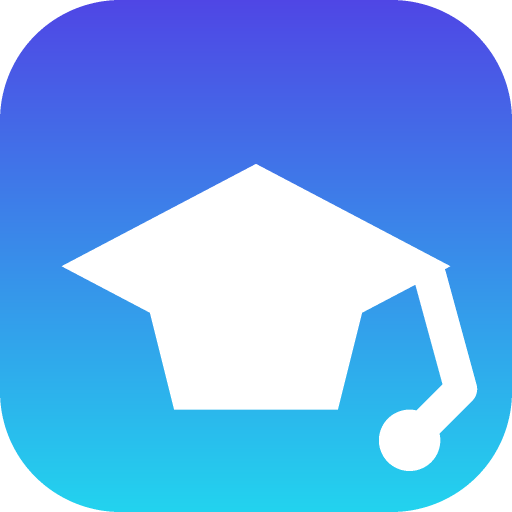

<div align="center">
  
  <h1>AI škola</h1>
  <p><strong>promptovanie · overovanie · zodpovednosť</strong></p>
  <p>Autonómna offline aplikácia pre výučbu zodpovedného používania AI.<br>
  Web + PWA + natívny Android APK. Bez kľúčov, bez API, bez siete.</p>
</div>

---

## Čo to je

Interaktívny slovenský kurz (s prepínačom EN/SK), ktorý učí **písať prompty, kontrolovať výstupy AI a niesť za ne zodpovednosť**. Beží úplne lokálne – progress sa ukladá iba do `localStorage`.

| | |
|---|---|
| **Formát** | PWA (inštalovateľná) + natívny Android APK |
| **Bundle** | 4,0 MB APK · 362 kB JS (gzip 121 kB) |
| **Sieť** | žiadne požiadavky po inštalácii |
| **Platformy** | Android 7.0+ (minSdk 24), moderný web |

## Obsah aplikácie

- **Vstupný kvíz** – 5 otázok, odporúčanie úrovne (začiatkár / pokročilý / expert)
- **6 modulov** s postupným odomykaním, minikvízmi a XP systémom
- **Hovorená verzia (TTS)** – natívne Web Speech API, offline, slovenský hlas, 4 rýchlosti
- **Prompt laboratórium** – *vlastná offline logika*, ktorá rozloží prompt na 5 kritérií
  (rola, kontext, formát, dôkazy, publikum), dá skóre 0–5, vygeneruje vylepšený prompt
  a ukáže simulovanú odpoveď so správnou štruktúrou
- **Knihovnica promptov** – 6 receptov s vysvetlením, prečo každý funguje
- **História pokusov** – posledných 5 rozborov v `localStorage`
- **Porovnanie** slabý vs. dobrý prompt, 4 prípadové štúdie, 20 denných výziev
- **Záverečný test** – 20 otázok, hranica 16/20
- **Certifikát SVG** – generovaný v prehliadači, s podpisom autora

## Technický stack

| Oblasť | Technológia |
|---|---|
| UI | **React 18** + **TypeScript** (strict) |
| Build | **Vite 5** |
| Štýly | **Tailwind CSS 3** (CSS premenné, dark/light) |
| Animácie | **Framer Motion** |
| PWA | Service Worker (cache-first) + Web App Manifest |
| Android | **Capacitor 7** + Gradle 8.14 + AGP 8.13 |
| Ikony | **vlastný PNG encoder** v Node.js (zlib, CRC32, 3× supersampling) |

## Zaujímavé technické rozhodnutia

### 1. Vlastný PNG encoder a rasterizér (bez závislostí)
Namiesto `sharp` alebo Canvas som napísal vlastný kód v `scripts/gen-icons.mjs`:
CRC32 tabuľka, PNG chunky (IHDR/IDAT/IEND), `zlib.deflateSync` a per-pixel rasterizácia
s 3× supersamplingom pre antialiasing. Z jedného skriptu vznikne **29 súborov**:
4 PWA ikony, 15 Android launcher ikon (5 hustôt) a 10 splash obrazoviek (portréto aj krajina).

### 2. Nulová závislosť na sieti
Prompt laboratórium nevolá žiadne API. `analyzePrompt()` je čistá funkcia s pravidlami
(regex + počítanie slov) – dá sa testovať a dá sa na ňu spoľahnúť offline.
Pôvodná verzia mala Anthropic proxy; tá bola odstránená, takže **aplikácia nemá backend**.

### 3. Service Worker
Cache-first pre statické assety (s `hashed` názvami z Vite), network-first pre navigáciu
s fallbackom na uložený shell. Aplikácia sa otvorí aj bez siete.

### 4. Android build kompatibilita
Projekt balí Capacitor 7, ktorý predpokladá `compileSdk 36`. Riešenie pre bežné SDK:
- zníženie `compileSdk` na **35** v `android/variables.gradle`
- zníženie androidx závislostí (activity 1.11 → 1.9.3, core 1.17 → 1.15, …)
- vylúčenie `kotlin-stdlib-jdk7/jdk8` v `android/build.gradle` (duplicitné triedy
  `kotlin.collections.jdk8.CollectionsJDK8Kt` po spojení stdlib 1.8.22 + jdk7/8 1.6.21)

### 5. Hovorená verzia bez závislostí
TTS je `src/components/TextToSpeech.tsx` – čisto `window.speechSynthesis`, žiadne CDN ani
balíčky. Tri veci, ktoré treba vedieť:

- **Dvojfázové delenie textu.** Chrome ticho zastaví `speechSynthesis` po ~15 s.
  Preto text najprv delíme podľa interpunkcie (`.` `!` `?` `;` `:` `…` nový riadok) a úseky
  dlhšie ako 150 znakov sekundárne po slovách na úseky max ~120 znakov. Bez toho by sa
  prehrávanie seknulo uprostred vety.
- **Asynchrónne hlasy.** Android WebView vracia `getVoices()` ako prázdne pole, preto
  hlasy načítavame cez `voiceschanged` + poistný `setInterval`. Hlas sa vyberá až pri
  `speak()`, nie pri mount-e. Priorita: `sk-SK` → `sk` → `cs` → `en`.
- **Žiadne visiace callbacky.** Front je rekurzívny (`onend` → ďalší úsek), každý beh má
  vlastný token a všetky `setTimeout` sú evidované v `timersRef`, aby sa dali zrušiť
  pri unmount-e alebo zmene textu.

Hlas: `sk-SK`. Na zariadení bez TTS sa komponent vôbec nerenderuje – žiadne mŕtve tlačidlá.

### 6. Service Worker
`public/sw.js` používa `CURRENT_CACHE_NAME`. Pri každej zmene verzie sa hodnota zmení,
`activate` zo `caches.keys()` zmaže všetky staré cache a `self.clients.claim()` prevezme
kontrolu nad už otvorenými oknami – bez toho by si používateľ držal starý shell aj po aktualizácii.

### 7. Android UI detaily
`viewport-fit=cover` + `env(safe-area-inset-*)` pre notch a gesture bar,
`theme-color` pre status bar, `-webkit-tap-highlight-color: transparent`,
launcher skratky cez `?view=` parametr v URL.

## Spustenie

```bash
npm install
npm run dev        # http://localhost:5173
```

Žiadne `.env`, žiadne kľúče, žiadna konfigurácia.

## Android

### Ako PWA (najrýchlejšie)
1. `npm run build && npm run preview`
2. Na telefóne otvoriť adresu v Chrome
3. ⋮ → **Pridať na domovskú obrazovku**

### Ako APK
```bash
npm run android:apk
# → android/app/build/outputs/apk/debug/app-debug.apk
```

Inštalácia: `adb install app-debug.apk` alebo prenesením APK na telefón.

### Príkazy

| Príkaz | Popis |
|---|---|
| `npm run dev` | vývojový server |
| `npm run build` | TypeScript kontrola + produkčný build |
| `npm run preview` | servírovanie buildu |
| `npm run icons` | znovu vygeneruje všetky ikony a splashe |
| `npm run android:sync` | build webu + skopírovanie do Android projektu |
| `npm run android:apk` | zostaví debug APK |
| `npm run android:open` | otvorí projekt v Android Studio |
| `npm run android:run` | spustí appku na pripojenom telefóne |

## Štruktúra

```text
src/
  App.tsx       # celá aplikácia: typy, i18n, obsah kurzusu, obrazovky
  main.tsx      # vstupný bod + registrácia service workera
  styles.css    # Tailwind + dizajnový systém (CSS premenné, safe-area)
public/
  manifest.webmanifest, sw.js, icons/
scripts/
  gen-icons.mjs # PNG encoder + rasterizér (bez závislostí)
android/        # Capacitor Android projekt
```

Všetko od typov po obrazovky je v jedinom `App.tsx` – jednoduché na čítanie,
bez importovacích hákanov a bez vrstiev, ktoré by nič nepridali.

## Autor

**Muller** – promptovanie, overovanie, zodpovednosť.
